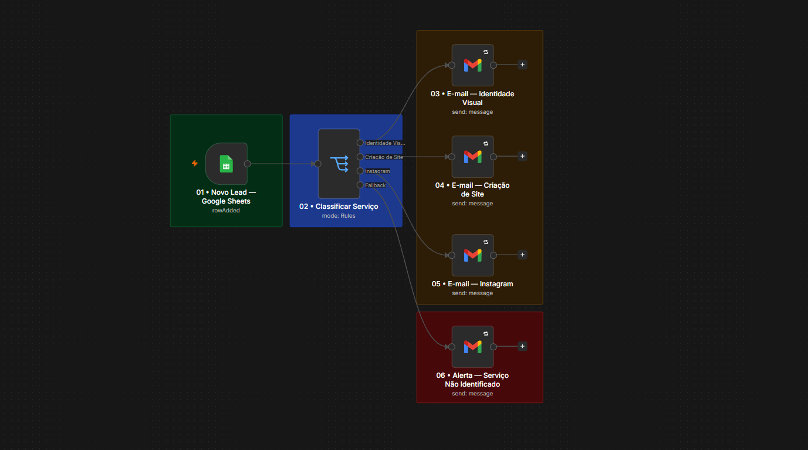
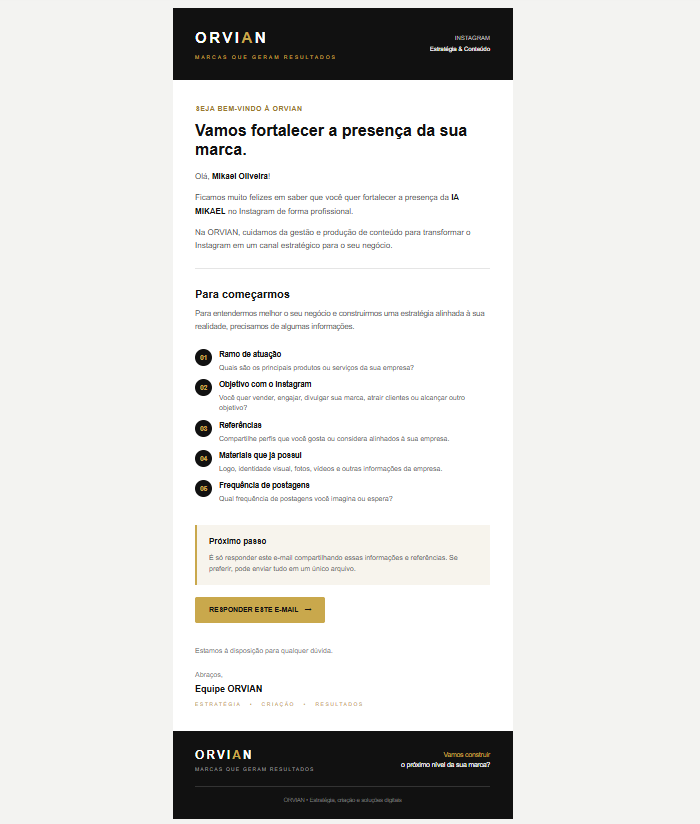

<div align="center">

# ORVIAN — Automação Comercial

### Captação, classificação e atendimento automático de leads com n8n

<p>
  <strong>Google Forms → Google Sheets → n8n → Switch → Gmail</strong>
</p>

<p>
  <em>Uma automação comercial criada para transformar novos contatos em oportunidades de atendimento personalizado.</em>
</p>

</div>

---

## 📸 Visão do Workflow

<div align="center">



</div>

> **ORVIAN** utiliza uma arquitetura visual simples: o lead entra pelo formulário, seus dados são recebidos pelo Google Sheets, o n8n identifica o serviço solicitado e envia automaticamente uma comunicação específica.

---

---

## ⚙️ Workflow n8n

O workflow completo está disponível para consulta e reutilização.

<div align="center">

[**→ Ver workflow n8n**](./workflow/orvian-commercial-automation.json)

</div>

> **Nota:** antes de executar o workflow, configure suas próprias credenciais do Google Sheets e Gmail e substitua os identificadores da planilha pelos seus.

---

## ✉️ Experiência do Lead

Além da automação interna, o projeto também foi desenvolvido para proporcionar uma experiência de comunicação mais profissional ao potencial cliente.

### Exemplo de e-mail recebido

<div align="center">



</div>

> O lead recebe uma comunicação personalizada de acordo com o serviço selecionado no formulário.

## 🎯 Sobre o Projeto

Este projeto é uma automação comercial desenvolvida para a **ORVIAN**, com o objetivo de reduzir tarefas manuais no primeiro contato com potenciais clientes.

O fluxo recebe uma nova solicitação comercial e identifica automaticamente o serviço de interesse para direcionar uma resposta adequada.

Em vez de enviar uma mensagem genérica para todos os contatos, cada lead recebe uma comunicação alinhada ao serviço selecionado.

### Serviços atualmente automatizados

- 🎨 **Identidade Visual**
- 🌐 **Criação de Site**
- 📱 **Instagram**
- ⚠️ **Não Identificado / Fallback**

---

## 🧩 Arquitetura

```text
┌─────────────────────┐
│    Google Forms     │
│   Captação do Lead  │
└──────────┬──────────┘
           │
           ▼
┌─────────────────────┐
│    Google Sheets    │
│   Base de respostas │
└──────────┬──────────┘
           │
           ▼
┌─────────────────────┐
│   n8n Trigger       │
│     Row Added       │
└──────────┬──────────┘
           │
           ▼
┌─────────────────────┐
│  Switch / Router    │
│ Classificação por   │
│      serviço        │
└──────┬──────┬───────┘
       │      │
       ▼      ▼
   Branding  Site
       │      │
       └──┬───┘
          │
          ▼
      Instagram

          +

   Fallback / Alerta
          │
          ▼
       Gmail
```

---

## ⚙️ Como funciona

### 01 — Captação

O potencial cliente preenche o formulário comercial da ORVIAN.

Os dados registrados incluem:

- Nome completo
- E-mail
- Nome da empresa
- Serviço desejado
- Trabalho / necessidade
- Orçamento estimado
- Como conheceu a ORVIAN
- Previsão de início do projeto

### 02 — Registro

O Google Forms envia automaticamente as respostas para uma planilha do Google Sheets.

### 03 — Trigger

O **Google Sheets Trigger** do n8n monitora a planilha.

Quando uma nova linha é adicionada:

```text
Row Added
```

o workflow é iniciado automaticamente.

### 04 — Classificação

O node **Switch** analisa o campo `Trabalho`.

A classificação utiliza `contains`, permitindo que o workflow encontre termos dentro do texto recebido.

Exemplo:

```text
Identidade Visual / Branding
          ↓
contains "Identidade"
          ↓
Identidade Visual
```

Outro exemplo:

```text
Instagram Profissional
          ↓
contains "Instagram"
          ↓
Instagram
```

### 05 — Comunicação

Depois da classificação, o lead é direcionado para o e-mail correspondente.

Cada serviço possui uma comunicação própria.

---

## 🔀 Regras do Switch

| Regra | Condição | Saída |
|---|---|---|
| 01 | `contains` → `Identidade` | Identidade Visual |
| 02 | `contains` → `Site` | Criação de Site |
| 03 | `contains` → `Instagram` | Instagram |
| Fallback | nenhuma regra encontrada | Não Identificado |

### Por que usar `contains`?

Durante os testes, o campo recebido pelo Google Sheets não correspondia exatamente ao texto configurado nas regras.

Por exemplo:

```text
Valor recebido:
Identidade Visual / Branding
```

Enquanto a regra esperava apenas:

```text
Identidade Visual
```

Com uma comparação exata, o item não era encaminhado.

A solução foi utilizar:

```text
contains
```

e procurar termos-chave.

Isso tornou a classificação mais tolerante a pequenas diferenças na resposta do formulário.

---

## ✉️ E-mails personalizados

O projeto não envia apenas uma resposta genérica.

Cada serviço possui uma comunicação própria.

### 🎨 Identidade Visual

O e-mail busca entender:

- História da empresa
- Personalidade da marca
- Público
- Posicionamento
- Referências visuais
- Identidade atual
- O que o cliente deseja transformar

### 🌐 Criação de Site

O e-mail busca entender:

- Sobre a empresa
- Objetivo do projeto
- Estrutura desejada
- Referências
- Materiais disponíveis

### 📱 Instagram

O e-mail busca entender:

- Ramo de atuação
- Objetivo com o Instagram
- Referências
- Materiais disponíveis
- Frequência de publicações

A lógica é simples:

> **Cada serviço possui um problema diferente. Portanto, cada serviço recebe perguntas diferentes.**

---

## 🧠 Personalização

Os e-mails utilizam dados enviados pelo próprio lead.

Exemplo:

```html
Olá, {{ $json["Nome Completo"] }}
```

E também:

```html
{{ $json["Nome da Empresa"] }}
```

O workflow consegue utilizar essas informações para personalizar automaticamente a comunicação.

---

## 🚨 Fallback

Nem todo valor recebido precisa necessariamente corresponder a uma regra existente.

Por isso existe uma saída de fallback:

```text
Serviço não identificado
        ↓
Alerta interno
        ↓
Análise manual
```

O fallback evita que uma solicitação seja simplesmente perdida.

Ele também pode ser utilizado futuramente para identificar novas categorias que precisam ser adicionadas ao fluxo.

---

## 🎨 Organização visual do workflow

O canvas foi organizado por função:

- 🟢 **Verde** → entrada / captura
- 🔵 **Azul** → processamento / classificação
- 🟡 **Amarelo** → comunicação / ação
- 🔴 **Vermelho** → exceção / fallback

### Estrutura visual

```text
🟢 Entrada
   ↓
🔵 Classificação
   ↓
🟡 Ações
   ↓
🔴 Exceções
```

A intenção é permitir que outra pessoa consiga entender o workflow rapidamente sem precisar abrir cada node.

---

## 🛠️ Tecnologias

| Tecnologia | Utilização |
|---|---|
| **n8n** | Orquestração da automação |
| **Google Forms** | Captação de leads |
| **Google Sheets** | Armazenamento das respostas |
| **Gmail** | Comunicação automática |
| **Switch** | Classificação por serviço |
| **HTML/CSS** | Estrutura dos e-mails |
| **Webhooks / APIs** | Possíveis integrações futuras |

---

## 📁 Estrutura sugerida

```text
orvian-commercial-automation/
│
├── README.md
│
├── assets/
│   └── workflow-switch.png
│
└── workflow/
    └── orvian-lead-automation.json
```

> O arquivo JSON do workflow pode ser exportado diretamente pelo n8n e versionado junto ao projeto.

---

## 🚀 Como executar

### 1. Criar o formulário

Configure o Google Forms com os campos comerciais necessários.

### 2. Conectar ao Google Sheets

Defina a planilha que receberá as respostas.

### 3. Configurar o n8n

Importe o workflow no n8n e configure as credenciais:

- Google Sheets
- Gmail

### 4. Configurar o Switch

Verifique as regras:

```text
Identidade → Identidade Visual
Site       → Criação de Site
Instagram  → Instagram
Fallback   → Não Identificado
```

### 5. Ativar o workflow

O trigger deve permanecer ativo para detectar novas linhas adicionadas à planilha.

### 6. Testar

Envie uma nova resposta pelo formulário.

O fluxo esperado é:

```text
Formulário
   ↓
Google Sheets
   ↓
n8n Trigger
   ↓
Switch
   ↓
E-mail específico
```

---

## 🧪 Testes realizados

Durante o desenvolvimento foram identificados e corrigidos alguns comportamentos importantes.

### Problema 1 — Switch não encaminhava os leads

**Causa:**

Comparação exata entre valores diferentes.

**Solução:**

Alteração para:

```text
contains
```

---

### Problema 2 — Execução manual retornava várias linhas

Ao utilizar **Execute Workflow**, o comportamento de teste podia carregar dados antigos da planilha.

Isso poderia resultar em vários e-mails sendo enviados novamente.

**Boa prática:**

Para validar o fluxo real, utilizar uma nova resposta do formulário com o workflow ativo.

---

### Problema 3 — Serviço sem correspondência

Foi criado um fallback para impedir que leads com valores inesperados desapareçam silenciosamente.

---

## 🔐 Segurança

Este projeto pode conter informações de leads e credenciais de serviços.

**Nunca versionar:**

```text
.env
credentials.json
tokens
senhas
API Keys
dados reais de clientes
```

Antes de publicar no GitHub, remova informações sensíveis do workflow exportado.

---

## 📈 Próximas evoluções

O workflow atual é a base de uma estrutura comercial maior.

Possíveis evoluções:

- [ ] Proteção contra leads duplicados
- [ ] Status `E-mail enviado` no Google Sheets
- [ ] CRM integrado
- [ ] WhatsApp automático
- [ ] Notificação interna para a equipe
- [ ] Classificação automática de leads
- [ ] Lead scoring
- [ ] IA para interpretar respostas abertas
- [ ] Geração automática de briefing
- [ ] Dashboard comercial
- [ ] Follow-up automático
- [ ] Histórico de interações

### Evolução com IA

Uma futura versão poderá utilizar IA para transformar respostas abertas em informações estruturadas:

```text
Resposta do cliente
        ↓
       IA
        ↓
┌──────────────────────┐
│ Serviço              │
│ Objetivo             │
│ Urgência             │
│ Orçamento            │
│ Perfil do negócio    │
│ Necessidades         │
└──────────┬───────────┘
           ↓
      Lead estruturado
```

Isso permitiria evoluir de uma simples automação de e-mail para um **sistema inteligente de pré-atendimento comercial**.

---

## 💼 Objetivo de negócio

O objetivo não é apenas automatizar o envio de e-mails.

A automação foi construída para:

- reduzir tarefas repetitivas;
- acelerar o primeiro contato;
- organizar informações comerciais;
- personalizar a comunicação;
- evitar perda de leads;
- criar uma base para futuras automações;
- melhorar a estrutura do processo comercial.

### Princípio do projeto

> **Automatizar o operacional para liberar tempo para o estratégico.**

---

## 👨‍💻 Projeto

**ORVIAN — Sites • Branding • Instagram • Automação**

Automação desenvolvida como parte da estrutura de processos comerciais da ORVIAN.

---

<div align="center">

### ORVIAN

**Tecnologia, estratégia e automação para negócios que querem crescer no digital.**

</div>
